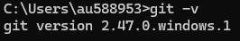

# Workshop
Welcome to the Git workshop!

## Preperation
### Install Git
First we need to install Git on your computer\
Download it here: https://git-scm.com/downloads \
Choose every default option when prompted\
\
When finished please open your Windows commandline and type "git -v"\
If it works correctly, it should look like the following:

### Create a Github user
Create a user at Github: https://github.com/ (If you do not already have one)

### Fork the workshop repository
The workshop tasks are found in a Github repository at: https://github.com/jesperstroem/Workshop\
To make it so you have your own personal copy of this repository, we need to "fork" it.\
While logged into your Github accound, go to https://github.com/jesperstroem/Workshop and press the down-arrow next to "fork" and then "Create a new fork".\
When the process is finished, you should see that you have a personal repository on Github, which is forked from mine.

## Workshop 1 - The basics
### Clone
The first task will be to clone your newly forked repository, such that you have it available on your local machine.\
In your shell, navigate to your desired folder and run the following commands (replace \<username> with your Github username):

    $ git clone https://github.com/<username>/Workshop.git
    $ cd Workshop
    $ ls -a

Now you should be able to see the files in the repository, which is copied from Github. Notice that there is also a .git folder, which tells you that it is a git repository.

### Add

### Summary
In workshop 1 you learned to use the following git commands:
- clone
- add
- status
- checkout
- commit
- pull
- push

## Workshop 2 - Branches and merges 

### Summary
In workshop 2 you learned to use the following git commands:
- branch
- diff
- merge

## Workshop 3 - Using .gitignore

### Summary
In workshop 3 you learned to use the .gitignore file so that you can ignore irrelevant files.