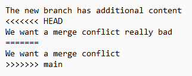

# Workshop
Welcome to the Git workshop!

## Preparation
### Install Git
First we need to install Git on your computer.

Download it here: https://git-scm.com/downloads

Choose every default option when prompted.

When finished please open your Windows commandline and type "git -v"

If it is installed correctly, it should look something like the following (version number does not have to match exactly):

### Create a Github user
Create a user at Github: https://github.com/ (If you do not already have one)

## Workshop 1 - The basics
### Create a new repository
The first thing we want to do is create a new Github repository.

Sign in at https://github.com/ and press "new" at the homepage.

Name your repository "Workshop", choose "Private" and check the box "Add a README file" (important).

Leave everything else as is and press "Create Repository".

### The Powershell

Now that we made a repository, open up a *Windows Powershell* on your computer.

Every step from here on assumes that you are working in a Windows Powershell.

If you for some reason do not have access to a Windows Powershell (Mac or Linux users), fear not.

All Git commands are the same, but the commands for directory and file manipulation may differ slightly.

They are however not essential to learning Git, they are just convenient.

### Prepare the shell

We need to run one command before starting with git:

    $PSDefaultParameterValues['Out-File:Encoding'] = 'utf8'

This will make it easier for us to work with Git and Powershell. Don't worry too much about it.

### Clone

In the shell, navigate to a folder where you want your new repository to reside.

I usually just have a folder on my C drive called "git repos", where i put my repositories.

You can create a new directory in powershell with `mkdir <name>`.

You can use the `cd` command to change folders and  `ls` to list folder content.

Then run the following command:

    git clone https://github.com/<username>/Workshop.git

Replace \<username> with your Github username.
   
Notice the following pop-up from Github:

You are seeing this because you have not yet authenticated yourself with Github.

Choose either option and follow the authentication flow. Authentication should not be necessary in the future.

Now run:

    cd Workshop
    ls -Force

Congratulations - you have cloned your first repository. Notice the output of `ls -Force`?

It shows you the content of the working directory. Right now it only contains a README and the .git folder.

### Add
Let's first add a new file to the working directory. Run the following command:

    echo "My first file" >> file.txt
    ls
    cat file.txt

`echo` creates a new .txt file, which you can see by running `ls`. Be sure to run echo with >> and not just >.

`cat file.txt` prints out the content of the file.

The file is in our *working directory*, however it is not yet in the *staging area* or the *repository*.

Now run:

    git status

This command shows you which files have changed and which have been staged. Note that Git has registered that you changed a file in the working directory.

To add the file to the staging area, we use `git add`. Run the following:

    git add file.txt
    git status

What does `git status` tell you now? You have successfully added a file to the *staging area*!.

When a file is staged, it is ready to be committed. So it is in the staging area, but not the repository.

But let's say that, before i commit, i want to change my file, because i made a mistake.

Run the following commands:

    echo "Useful content" >> file.txt
    cat file.txt

Now what happens if you run `git status`? Observe that Git remembers what you have staged - however it also notices your new changes.

To stage the new changes, simply run `git add file.txt` once more.

Note that you can also run `git add .` to simultaneously stage all changes in the working directory. This tends to be easier when you change a lot of files.

### Commit
To commit your staged changes, run the following command:

    git commit -m "Added some useful content"

The -m option adds a commit message. This message should in broad terms say what changed for the commit. Taking the time to write good commit messages is worth it - to help yourself later when you forgot what changed.

Now try to run `git status` and `git log`.

`git status` should tell you that your local repository is 1 commit ahead of the remote repository.

`git log` should show you the commit history with your new commit.

### Diff & restore
Try to make the following changes without staging it:

    rm file.txt
    echo "New content" >> file.txt
    cat file.txt
    git status

Once again we see that Git has registered a change to the file. But what if we wanted to know exactly what changed? Run the diff command:

    git diff file.txt

Notice how Git shows you what was removed, and what was added. This command is useful if you forgot what changed since your last commit.

Now stage the file with `git add file.txt`. 

The file is now ready for a commit. But what if we regretted adding this file to the staging area? We can fix that with `git restore`. Run the following:

    git restore --staged file.txt
    git status

Notice that the change is still in our working directory but that `git status` now shows the change as unstaged.

Try to run `git add file.txt` and `git commit -m "Second commit"` to stage and commit the new change.

Notice how `git status` will now show you that your local repository is 2 commits ahead of the remote.

### Pull
Our next goal is to upload our newly created commits to the remote repository on Github. However, you should now ask yourself - What if someone else changed the remote repository since i cloned it in the beginning of the workshop? 

To simulate this situation, i want you to go to Github and perform a remote commit.

From the homepage of your repository, choose the README file and press the edit sign in the right-hand side:

In the online editor, write "Read this README file" below the headline and press "commit changes" twice.

Now you have created a remote commit that changed the content of the README file.

Now go back to your powershell and run:

    git pull

What just happened is that git pulled the remote commit and "merged" it with your local commits.

In this situation, git does that automatically, because they were separate files. However, sometimes you will have to do it manually, which we will get to later. 

Mow that we have pulled we can safely "push" our new commits.

### Push
Run the following:

    git push

As a final task, try to run `git log` and examine the output. What does it tell you?

Try also to run `git status`. Observe how Git tells you that your local repository is up to date with the remote.

### Checkout
So far so good - but a fundamental benefit of Git should be for us to return to an earlier commit, right?

Try to run `git log` and find the entry of your very first commit (probably called "Initial commit"). Notice how the commit has an ID in the top after "commit"?

Copy the string and run:

    git checkout <ID>
    ls

What do you notice? The working directory is now back to it's initial state!

Run the following command to return to the newest commit:

    git checkout -

### Explore Github
Try to go to the page of your Github repository and explore the information available.

Do you see your changes? Your local commits? The remote commit? What do you see if you pick a certain file and press "history" in the right-hand side of the web page?

### Summary
In workshop 1 you learned how to follow a basic git workflow.

That includes the following git commands:

- clone
- add
- status
- restore
- diff
- commit
- pull
- push
- checkout

These are in my opinion the most valuable and commonly used commands. With these in your toolbox you are already able to get started in your own research.

What you learn from this point is mostly building on top of this solid foundation.

## Workshop 2 - Branches and merges
Managing branches is a very valuable skill that will allow you to keep multiple separate versions of the repository in parallel.

### Creating branches

Try to run the following:

    git branch

This command tells you which branches are currently available in your repository - there should only be a default "main" branch which every git repository will start with.

This is also the branch we have been working on so far. It contains multiple commits and therefore multiple snapshots of the code, but it is still only one branch.

Notice the * which tells you that you are currently on that branch - in git terminology you have "checked out" the main branch.

To start a new branch run the following:

    git branch experiment
    git branch

This will create a new branch called "experiment".

By running `git branch` you will notice the new branch, but that the * is still at main.

Now you can simply run `git checkout experiment` to switch between the branches. Run `git branch` to verify that it worked.

Notice how we used the checkout command again - but this time we checkout a branch and not a commit.

Try to switch back and forth between experiment and main.

What do you notice? The branches at this point are completely identical - since experiment "spawned" from the latest commit at main, and we have not made any new commits yet.

Check out the experiment branch and run the following commands:

    echo "Now we are on another branch" >> file.txt
    echo "The new branch has additional content" >> new.txt

This edits the existing "file.txt" and adds another file called "new.txt".

Run `git add .` and `git commit -m "Commit on new branch"`.

At this point we are pretty experienced git users, so we know that the next step is to run `git pull`. Go ahead and do that.

What does git tell you? Why does it fail?

The answer is pretty simple - your new branch is not linked to any remote branch, so git does not know where to pull from!

We can easily fix this by running:

    git push --set-upstream origin experiment

This tells git to push to a new remote branch called experiment and links the local and remote branch together.

Try to run `git branch -a` to see all branches in the repository including the remote ones.

Run `git status` to verify that the local branch is up to date with the remote branch.

Try to switch back and forth between the main and experiment branch with `git checkout <branch>` and observe the files in the working directory changing.

As a last effort, have a look at Github and explore your branch history. "Insights" -> "Network" will give you a visualization of your branch and commit history.

Congratulations - you now know how to keep multiple versions of your code!

### Merging
The next step is to learn about merging. A very common task when working with multiple branches, is that you want the branches to merge - in other words, you want the changes on one branch to be reflected in another branch.

You already did it in the earlier assignment, but that was on the same branch. However, the process is basically the same.

In our case, we want our changes to the experiment branch to be merged back into the main branch.
To do so, run the following:

    git checkout main
    git merge experiment
    git pull
    git push
    ls
    cat file.txt

What do you notice now? Our working directory contains the new .txt file and the contents of file.txt has changed.

In this case, the merge operation went well, because git did so automatically.

However, sometimes merge conflicts will arise and you should know how to solve them.

### Fixing merge conflicts
Now try changing the contents of new.txt, add the changes and commit:

    echo "We want a merge conflict" >> new.txt
    git add .
    git commit -m "Get ready for merge conflicts"

Now do the following:

    git checkout experiment
    echo "We want a merge conflict really bad" >> new.txt
    git add .
    git commit -m "Merge conflicts are easy to solve"

Now we have made two separate commits on main and experiment, and the content of new.txt is different - but let's try to merge and see what happens:

    git merge main
    git status

What does the output tell you? You have a merge conflict, and it is because of new.txt.

Try to open new.txt file in a notepad - what do you see?

This notation may look very weird to you - but fear not, it is actually rather simple

Git tells you, that HEAD (meaning your current commit) has a different line of text than the main branch.

This creates a conflict - how is git supposed to know which line is the one you want?

Answer - it doesn't, and we need to specify it!

To do so, delete everything in the file except for "The new branch has additional content" and "We want a merge conflict".

You have now told Git what the file should look like, and we are ready to commit, pull and push:

    git add .
    git commit -m "I solved the merge conflict on my own!"
    git pull
    git push

### Summary
In workshop 2 you learned how to use branches and how to merge them together.

You also learned how to fix merge conflicts, when they appear.

To do so you learned to use the following git commands:

- branch
- merge

## Workshop 3 - Using .gitignore
You now master the very basic git skills to get started on your journey with version control.

The last thing you should learn is how to configure the .gitignore.

The .gitignore file tells git which files in the repository you do not want to have under version control.

This is useful for many different things - i personally use it for cached files, larger files (images etc.) or log files.

First, download any image of Google and put it inside your repository and run `git status` to verify that git sees the new image.

Now, run the following:

    echo <name of your image file> >> .gitignore

Observe the content of the newly created .gitignore file. What do you think this means?

You will get the answer by running:

    git add .gitignore
    git status
    ls -a

Notice how `git status` does not see the newly uploaded image file, however, when you run `ls -a` you still see the image file.

This is because we told git to ignore the file.

### Extra
Go to https://git-scm.com/docs/gitignore and read about the syntax of the .gitignore file.

Play around with your repository and the .gitignore file.

### Summary
In workshop 3 you learned to use the .gitignore file so that you can ignore files that should not be included in the version control.
